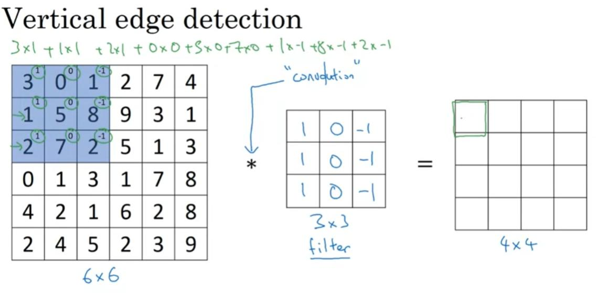
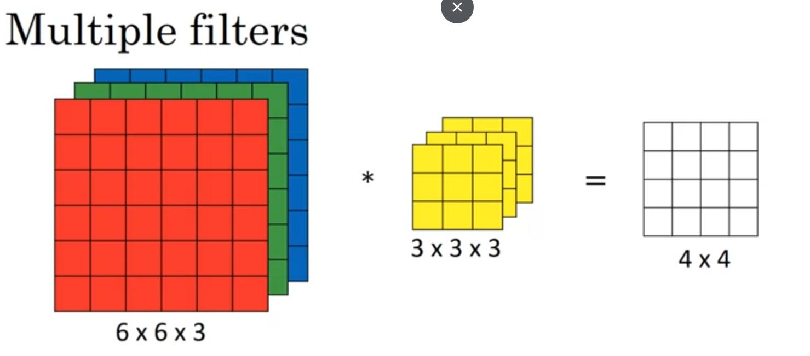

# Convolutional Neural Networks
---

## Week1

* Edge detection using Convolution operation: n x n * f x f = (n - f + 1) x (n - f + 1)

* Padding: ex p = 1, n x n -> (n + 2p) x (n + 2p)

    Valid: no padding

    Same: size output = size input

* Stride: padding p, strid s

    n x n * f x f = (n + 2p - f) / 2 + 1    x    (n + 2p - f) / 2  + 1

* Conv over volume

    n x n x n_c *  f x f x f_d =  (n - f + 1) x (n - f + 1) x n_c

    n_c: num filter
