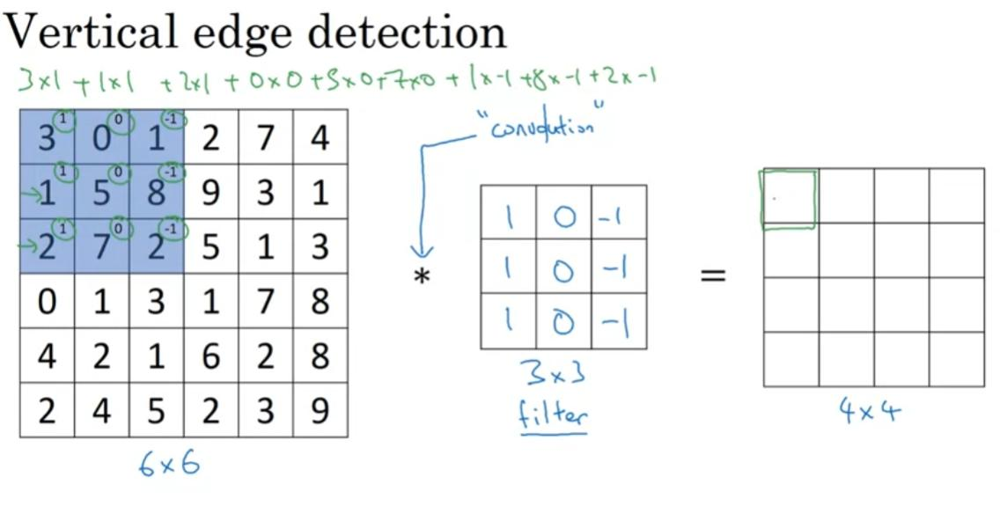
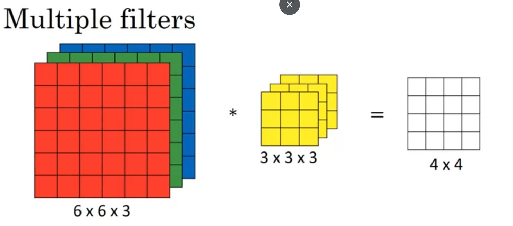

# Convolutional Neural Networks
---

## Week1

* Edge detection using Convolution operation: n x n * f x f = (n - f + 1) x (n - f + 1)

* Padding: ex p = 1, n x n -> (n + 2p) x (n + 2p)

    Valid: no padding

    Same: size output = size input

* Stride: padding p, strid s

    n x n * f x f = (n + 2p - f) / s + 1    x    (n + 2p - f) / s  + 1

* Conv over volume

    n x n x n_c *  f x f x f_d =  (n - f + 1) x (n - f + 1) x n_c

    n_c: num filter

* Number of parameters

    (f[l] * f[l] x n_c[l-1] + 1) x n_c[l]
    f[l] filter height 
    n_c[l-1] number of channels previous layer
    n_c[l] number of channels current layers
    1 bias

* Why convolutions

    Parameter sharing: A feature detector that's useful in one part of the image is probably useful in another part of the image (vi du filter phat hien canh o nhieu vi tri tren buc anh)
    Sparsity of connections: In each layer, each output value depends only on a smaill number of inputs
    good at capturing translation invariance

## Week2

- Lenet-5 (1998)
- Alexnet (2012)
- VGG (2014)
- InceptionNet (2014)
- ResNet (2015)
- DenseNet (2017)
- MobileNet (2017)

## Week3

- Object localization
- Object detection
- Semantic segmantation
- YOLO algorithm

## Week4

- Face regconition
- Neural style transfer